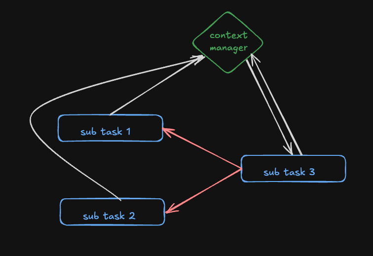

# Architecture & Design

Our system follows a **multi-agent, DAG-based (Directed Acyclic Graph) architecture**. A single user prompt can be orchestrated into multiple tool invocations, where execution order is governed by **`TOOL_PRIORITY`**.

To facilitate smooth data handoff between tasks, we have introduced a **Context Manager**. It maintains the execution context of previously completed tasks, making their outputs readily accessible for downstream tasks. As a result, every tool operates with the most relevant, updated context, significantly reducing redundancy and improving orchestration efficiency.

<p align="center">
  
</p>

### Example DAG Flow

Consider the user prompt:
_"Add 10 to the average temperature in Paris and London right now."_

The orchestration layer builds the following DAG:

- **Tool A (Temp Tool)**

  - Fetches the current temperature in Paris.
  - No dependencies.

- **Tool B (Temp Tool)**

  - Fetches the current temperature in London.
  - No dependencies.

- **Tool C (Calc Tool)**

  - Computes the average of Paris and London temperatures.
  - Adds 10 to the computed average.
  - **Depends on Tool A and Tool B**.

# Installation & Running

There is a `Makefile` to simplify setup, testing, and running. You can either use the provided make targets or follow the manual steps.

---

### Using Makefile

Ensure you have **Python 3.9+** installed.

1. **Setup the virtual environment and install dependencies:**

   ```bash
   make setup
   ```

2. **Run tests (pytest):**

   ```bash
   make test
   ```

3. **Run the agent with a sample prompt:**

   ```bash
   make run
   ```

4. **Format code (placeholder – configure with your formatter, e.g., black/isort):**

   ```bash
   make fmt
   ```

---

### Manual Setup

If you prefer not to use `make`:

1. **Create a virtual environment:**

   ```bash
   python -m venv .venv
   source .venv/bin/activate
   ```

2. **Install dependencies:**

   ```bash
   pip install -r requirements.txt
   ```

3. **Run tests:**

   ```bash
   python -m pytest tests/test_smoke.py
   ```

4. **Run the agent with a sample prompt:**

   ```bash
   python main.py "What is 12.5% of 243?"
   ```

# Tools & Functionalities

The system leverages a **tool-augmented orchestration layer**. A lightweight **fake LLM** is responsible for parsing the user prompt using **keyword matching**. Based on these matches, it determines:

1. **Which tools need to be invoked.**
2. **In what sequence they should execute.**

We currently support **four tools**:

---

### 1. Calc Tool

The **Calc Tool** evaluates arithmetic expressions within a prompt.

**Flow (from code):**

1. **Normalization**

   - Converts natural-language operators into symbols (`plus → +`, `average → A`, etc.).
   - Cleans up conjunctions like `and`.

2. **Tokenization**

   - Splits the expression into numbers and operators.
   - Handles parentheses and operator precedence.

3. **Evaluation**

   - Uses a stack-based algorithm to compute values.
   - Supports `+`, `-`, `*`, `/`, `%` (percentage), and `A` (average).
   - Handles **unary minus** correctly (e.g., `-5`).

4. **Context Integration**

   - If placeholders exist in the expression, they’re replaced from context.
   - The result is cached back into the context for downstream tasks.

📌 **Example:**
Prompt: _"What is the average of 10 and 20, plus 5% of 200?"_
→ Normalized → `A(10,20) + 5%200`
→ Evaluated → `15 + 10 = 25`

---

### 2. Temp Tool

The **Temp Tool** retrieves static weather information (mocked from in-memory maps).

**Flow (from code):**

1. Takes **city** and **keyword** (e.g., `"Paris"`, `"temperature"`).
2. Matches keyword:

   - `"temperature"`, `"temp"`, `"humidity"` → numeric temperature lookup.
   - `"weather"`, `"condition"` → textual condition lookup.
   - Default fallback → temperature.

3. Stores result into context for reuse.

📌 **Example:**
Prompt: _"What’s the temperature in London?"_
→ Returns `15°C` (mocked).

---

### 3. Knowledge Base Tool

The **Knowledge Base Tool** answers queries directly from a predefined knowledge base.

- Input: free-form user query.
- Output: matched fact or `"not found"`.
- Useful for FAQs and domain-specific lookups.

📌 **Example:**
Prompt: _"Who founded OpenAI?"_
→ Returns `"Elon Musk, Sam Altman, and others"` (from knowledge base).

---

### 4. Job Search Tool

The **Job Search Tool** performs structured filtering over a **jobs dataset (`data/jobs.json`)**.

**Flow (from code):**

1. Parses search arguments (`role`, `location`, `date_posted`, `company`).
2. Maps natural date filters like _"today"_ or _"last week"_ into standard values (`24h`, `1w`, `1m`).
3. Loads job postings from `jobs.json`.
4. Iterates through each job and applies filters.
5. Returns a list of matching jobs.

📌 **Example:**
Prompt: _"Find software engineer roles in Dhaka posted last week."_
→ Args: `{role: "software engineer", location: "dhaka", date_posted: "last week"}`
→ Mapped date: `"1w"`
→ Returns all matching jobs from dataset.

---

### Orchestration Example

Prompt:
_"Add 10 to the average temperature in Paris and London right now."_

1. **Fake LLM** detects → needs `Temp Tool` (Paris, London), `Calc Tool` (average, +10).
2. **Execution DAG:**

```
Temp(Paris) ─┐
             ├─> Calc(Average) ──> Calc(+10) ──> Final Output
Temp(London) ┘
```

3. **Context Flow:**

   - `Temp Tool` writes `{paris: 20, london: 15}`
   - `Calc Tool` computes `(20+15)/2 = 17.5`
   - `Calc Tool` adds 10 → `27.5`

4. **Result:** `"The final answer is 27.5"`
